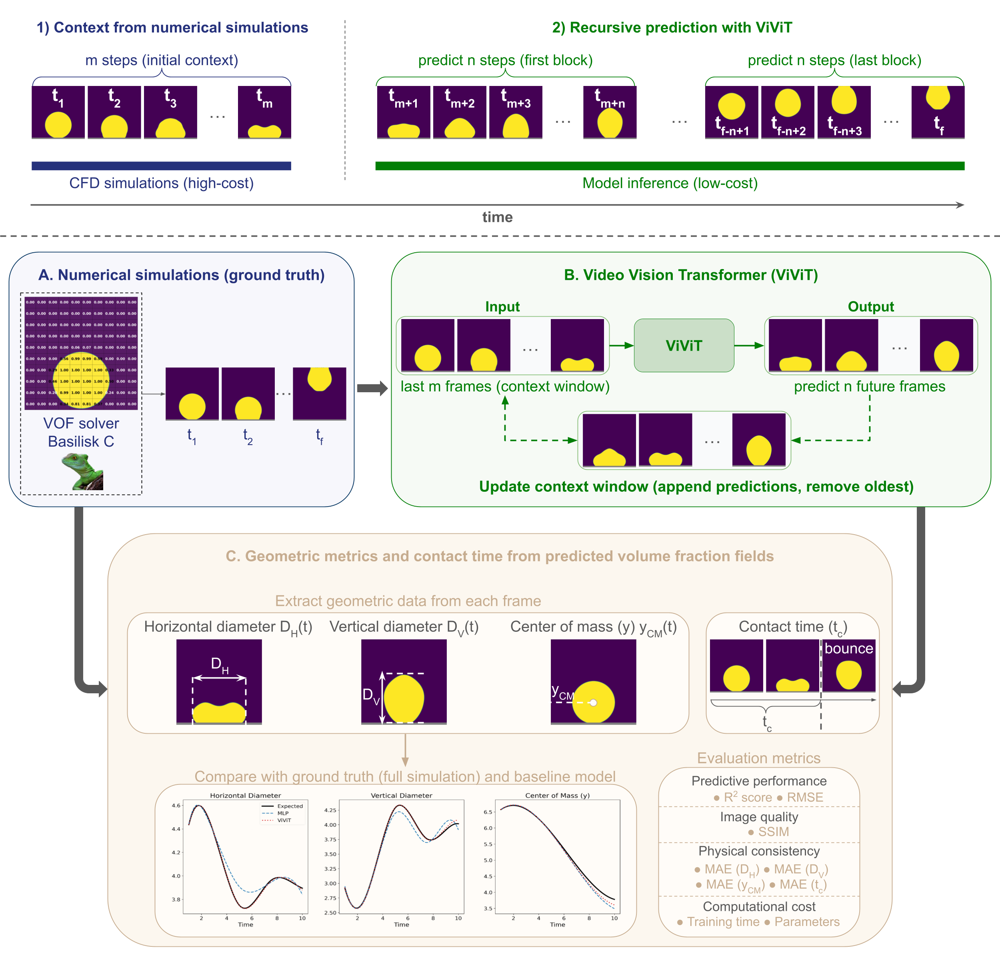

# FlowML-Toolkit

FlowML-Toolkit is an open-source graphical toolkit that provides machine learning applications for fluid flow simulations and experiments. The current version includes a Video Vision Transformer (ViViT) framework capable of predicting the spatio-temporal evolution of viscoelastic droplets impacting solid surfaces directly from Volume of Fluid (VOF) fields. By using only an initial temporal context, the framework predicts the remaining evolution of the fluid interface, reducing computational cost compared to full CFD simulations.

<p align="center"> <a href="https://arxiv.org/abs/2606.23940">Paper</a> </p>

<p align="center">  </p>

## Repository structure

```text
FlowML-Toolkit/
│
├── main.py                     Main application entry point
├── requirements.txt            Python dependencies
├── logo.png                    Application icon
│
├── tools/
│   ├── registry.py             Registry of available applications
│   │
│   └── vof_prediction/
│       ├── view.py             Graphical interface
│       ├── methods.py          Prediction and analysis routines
│       ├── architectures/      ViViT architecture definitions
│       ├── models/             Pretrained models
│       └── examples/           Example samples
│
└── figures/
    └── vof_prediction/
        └── pipeline.png        Framework overview
```    

## Installation

Clone the repository:

git clone https://github.com/DiegoalexG/FlowML-Toolkit.git
cd FlowML-Toolkit

Install the required pyhon packages:

pip install -r requirements.txt

### Model download

Download the pretrained models and place them inside:

```text
tools/vof_prediction/models/
```

| Model | Description | Download |
|---------|---------|---------|
| ViViT 50→1 | 50-frame context → 1-frame prediction | [Google Drive](https://drive.google.com/file/d/1rbynAZJaVYsv5na1AI6MKYWodc-Ywn_o/view?usp=sharing) |
| ViViT 50→50 | 50-frame context → 50-frame prediction | [Google Drive](https://drive.google.com/file/d/1CvyL0um2JpwfpW8jR2BqDWI-kSJ7h4s9/view?usp=sharing) |
| ViViT 100→100 | 100-frame context → 100-frame prediction | [Google Drive](https://drive.google.com/file/d/10k7JjHcYHMbsW9Sj1M5kvYepSLHwx5Dl/view?usp=sharing) |

Expected directory structure:

```text
tools/
└── vof_prediction/
    └── models/
        ├── model_vivit_50_1.keras
        ├── model_vivit_50_50.keras
        └── model_vivit_100_100.keras
```

## Running the application

Launch the graphical interface:

python main.py

## How to use

### Step 1 - Open the application

After launching FlowML-Toolkit, select:

VOF Prediction

from either:

- Home page
- Tools menu

### Step 2 - Select a model

Choose one of the available pretrained ViViT models:

- ViViT 50→1
- ViViT 50→50
- ViViT 100→100

### Step 3 - Load input data

Load a simulation sample containing the volume fraction sequence and the corresponding physical parameters. The application expects a dictionary with the following structure:

| Key | Description |
|------|-------------|
| `sample` | Time sequence of volume fraction (VOF) fields |
| `Re` | Reynolds number |
| `We` | Weber number |
| `beta` | Solvent viscosity ratio |
| `Wi` | Weissenberg number |
| `x_range` | Spatial domain limits in the x-direction |
| `y_range` | Spatial domain limits in the y-direction |
| `t_range` | Temporal domain limits |

The application automatically extracts the temporal context from the `sample` field and prepares the input sequence required by the selected ViViT model. Example input files are provided in:

```text
tools/vof_prediction/examples/
```

### Step 4 - Run prediction

Select one of the available pretrained models:

- ViViT 50→1
- ViViT 50→50
- ViViT 100→100

Alternatively, the **Compare all models** option can be selected to evaluate all pretrained models simultaneously on the same sample. 

### Step 5 - Analyze results

After the prediction process is completed, the application provides several metrics for comparing the predicted and expected results, including horizontal and vertical diameters, center of mass, contact time, R²-score, RMSE, and SSIM. The generated results can be exported using the **Save results to .npz** option. The output file contains the following entries:

| Key | Description |
|------|-------------|
| `predicted` | Predicted volume fraction fields |
| `d_horizontal_test` | Reference horizontal diameter evolution |
| `d_horizontal_pred` | Predicted horizontal diameter evolution |
| `d_vertical_test` | Reference vertical diameter evolution |
| `d_vertical_pred` | Predicted vertical diameter evolution |
| `c_mass_test` | Reference center of mass evolution |
| `c_mass_pred` | Predicted center of mass evolution |
| `t_contact_test` | Reference contact time |
| `t_contact_pred` | Predicted contact time |
| `r2s` | R²-score values |
| `rmse` | Root Mean Square Error (RMSE) values |
| `ssim` | Structural Similarity Index (SSIM) values |

## Dataset

The models were trained using simulations generated with the open-source flow solver Basilisk. The simulations consider variations in:

- Reynolds number (Re)
- Weber number (We)
- Solvent viscosity ratio (β)
- Weissenberg number (Wi)

covering both spreading and bouncing regimes.

## Citation

If you use this repository in your research, please cite:

```bibtex
@misc{deaguiar2026predictionviscoelasticdropletimpact,
      title={Prediction of Viscoelastic Droplet Impact Dynamics Using a Vision Transformer-Based Approach}, 
      author={Diego A. de Aguiar and Cassio M. Oishi},
      year={2026},
      eprint={2606.23940},
      archivePrefix={arXiv},
      primaryClass={physics.flu-dyn},
      url={https://arxiv.org/abs/2606.23940}, 
}
```
